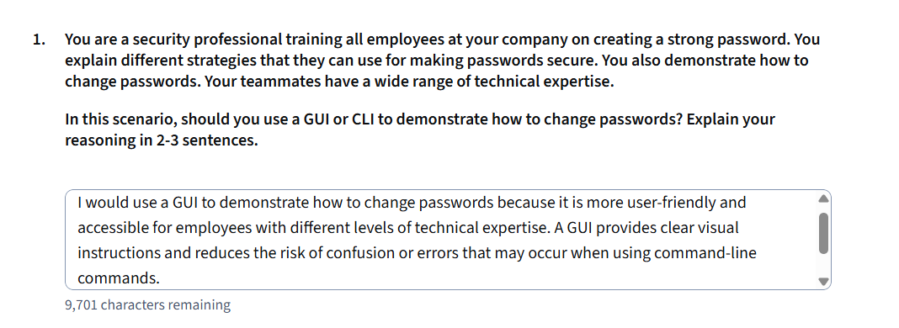
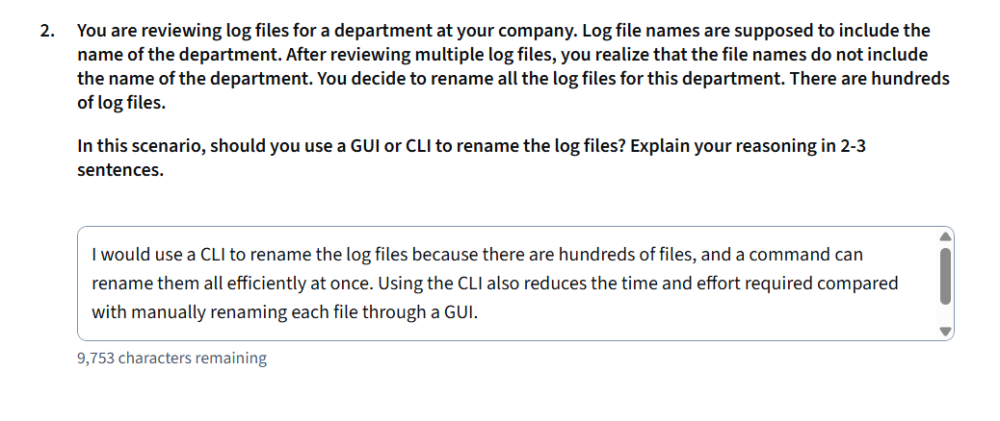
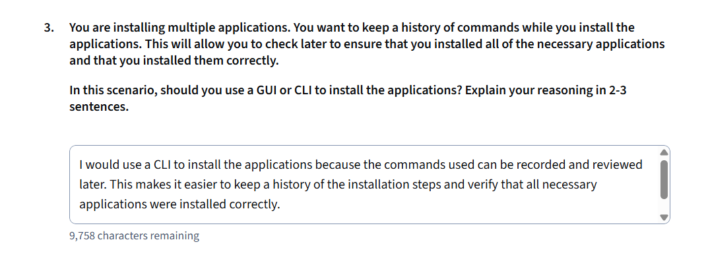

# Activity: Select the User Interface

## Activity Overview
This activity evaluates three distinct operational scenarios to determine whether a Graphical User Interface (GUI) or a Command-Line Interface (CLI) is more effective based on technical requirements, administrative efficiency, and user accessibility.

---

## Question 1: Password Demonstration
* **Scenario:** Training employees on creating and changing passwords.
* **Selection:** **GUI (Graphical User Interface)**
* **Reasoning:** A GUI provides an intuitive visual interface that reduces friction and confusion for employees with varying levels of technical expertise.

---

## Question 2: Log File Renaming
* **Scenario:** Batch renaming hundreds of department log files.
* **Selection:** **CLI (Command-Line Interface)**
* **Reasoning:** Command-line commands and scripts allow for batch processing and automated bulk renaming, saving significant time compared to manual GUI renaming.

---

## Question 3: Installation Audit History
* **Scenario:** Installing multiple applications while maintaining a verifiable command history.
* **Selection:** **CLI (Command-Line Interface)**
* **Reasoning:** CLI environments automatically capture command history in shell log files, creating a built-in audit trail to verify proper installations.

