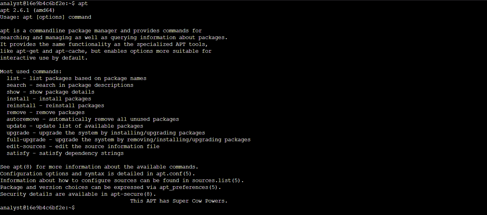
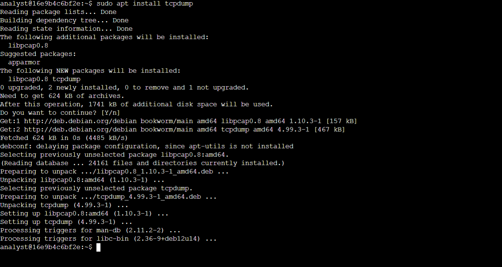
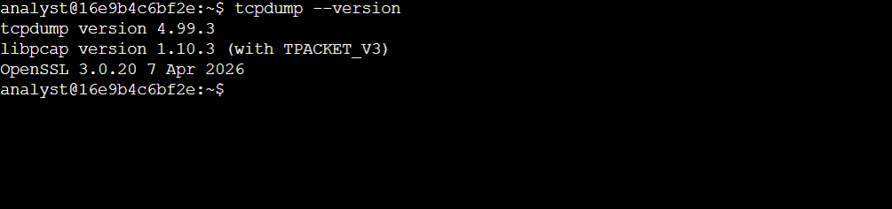
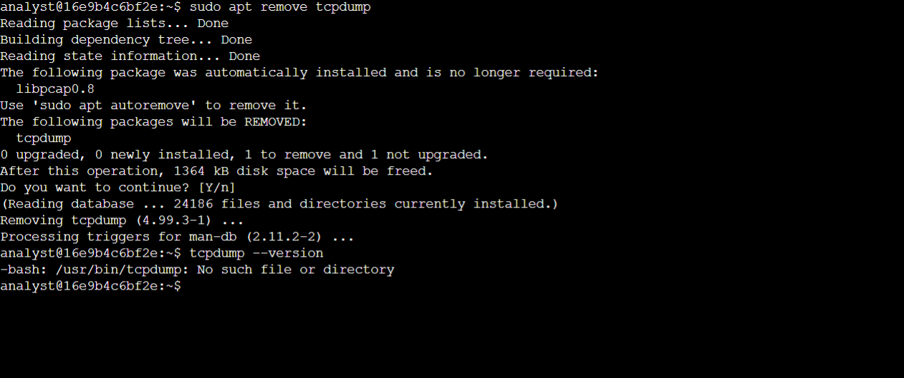
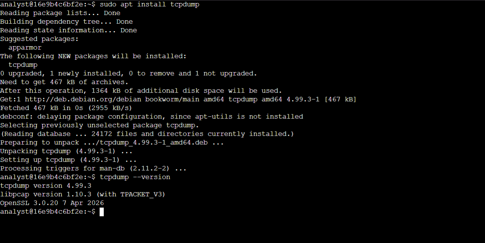
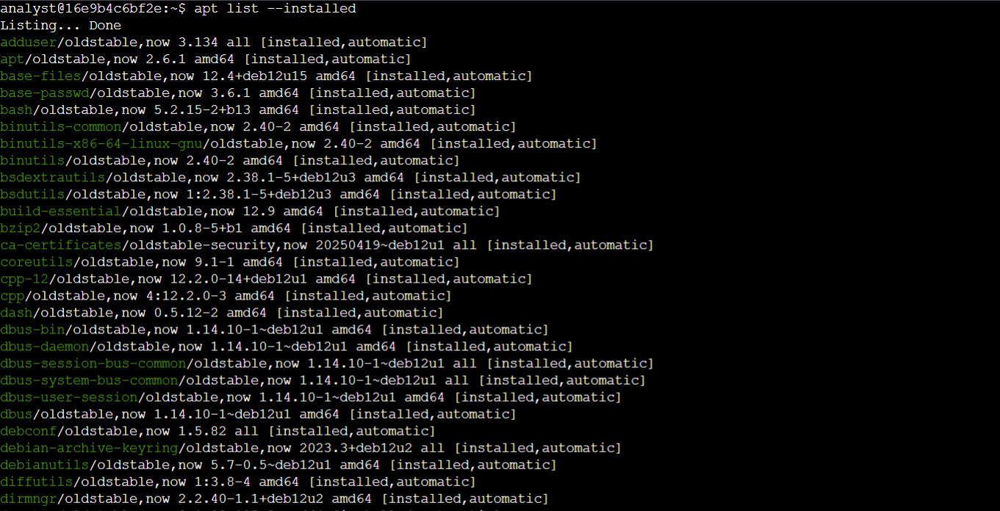

# Linux Application Management with APT

## Overview

This lab provided hands-on practice using the **Advanced Package Tool (APT)** and **sudo** to manage applications in a Debian-based Linux environment.

The activity focused on installing, unistalling and verifying **tcpdump**, a command-line tool used to capture and analyze network traffic.

The lab was performed in a Linux Bash shell running on a virtual machine.

## Objectives

- Confirm that the APT package manager is available
- Install and verify tcpdump
- Uninstall and verify the removal of tcpdump
- Reinstall tcpdump
- List installed applications

## Environment

- **Operating System:** Debian GNU/Linux 12 (Bookworm)
- **Shell:** Bash
- **Package Manager:** APT

## Tasks Completed

### 1. Verify APT

Confirmed that the APT package manager was available by running:

```bash
apt
```
The output confirmed that APT was available and ready to manage packages in the Debian Linux environment.

#### Lab Screenshot



### 2. Install tcpdump

Installed the tcpdump network analysis utility using:

```bash
sudo apt install tcpdump
```

The package was successfully installed in the Debian Linux environment.

#### Lab Screenshot



### 3. Verify tcpdump Installation

Verified the tcpdump installation using:

```bash
tcpdump --version
```

The output confirmed that tcpdump was installed and available.

#### Lab Screenshot



### 4. Uninstall tcpdump

Removed tcpdump using:

```bash
sudo apt remove tcpdump
```

The package was successfully removed from the Linux environment and the removal was verified.

#### Lab Screenshot



### 5. Reinstall and Verify tcpdump

Reinstalled tcpdump using:

```bash
sudo apt install tcpdump
```

The installation was completed successfully and tcpdump was verified after reinstallation.

#### Lab Screenshot



### 6. List Installed Packages

Listed the installed packages on the Debian Linux system using:

```bash
apt list --installed
```

This displayed the packages currently installed on the system.

#### Lab Screenshot




