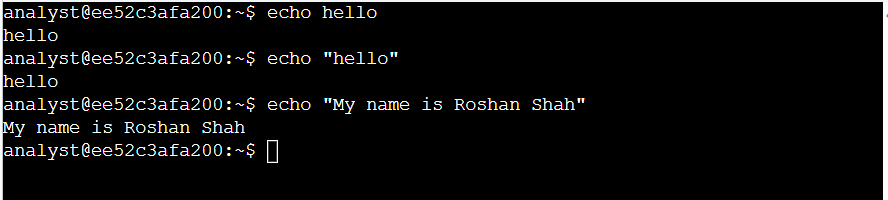

# Examine Input and Output in the Shell

## Activity Overview

This lab provided hands-on practice with basic Linux shell commands for examining input and output in the Bash shell.

The activity focused on using `echo` to generate output, `expr` to perform basic calculations, and `clear` to clear the shell window.

## Objectives

- Generate output in the shell using the `echo` command
- Perform basic calculations using the `expr` command
- Clear the shell window using the `clear` command

## Environment

- **Operating System:** Debian GNU/Linux 12 (Bookworm)
- **Shell:** Bash
- **Environment:** Linux virtual machine

## Tasks Completed

### 1. Generate Output Using echo

Used the `echo` command to display text in the shell:

```bash
echo hello
echo "hello"
echo "My name is Roshan Shah"
```
#### Lab Screenshot



### 2. Perform Calculations Using expr

Used the `expr` command to perform a basic arithmetic calculation:

```bash
expr 32 - 8
expr 3500 * 12
```
#### Lab Screenshot


### 3. Clear the Shell Window

Used the `clear` command to clear the visible contents of the terminal:

```bash
clear
```
#### Lab Screenshot


### 4. Combined Command Execution

Executed the `echo`, `expr`, and `clear` commands during the same lab session to practice basic shell input and output operations.


```bash
echo "Hello Roshan"
expr 52 / 2
clear
```

#### Lab Screenshot

