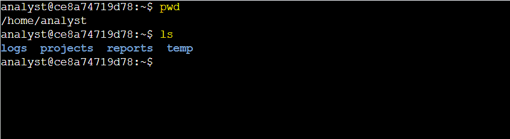
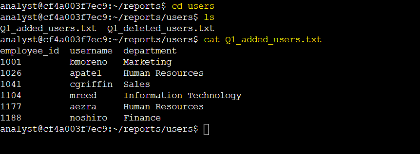
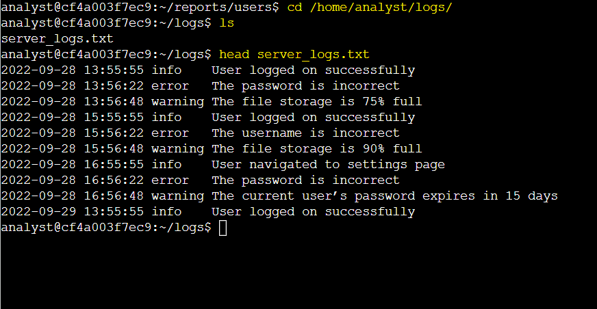

# Activity 4: Find Files with Linux Commands

## Activity Overview

This lab provided hands-on practice with navigating the Linux file system, locating files and directories, and reading file contents using the Bash shell.

The activity focused on using the command-line interface to work with files and directories in a Linux environment.

## Objectives

In this lab, I practiced how to:

- Identify the current working directory.
- List the contents of a directory.
- Navigate between directories.
- Display the contents of a file.
- Display the first 10 lines of a file.

## Commands Used

| Command | Purpose |
|---|---|
| `pwd` | Displays the current working directory |
| `ls` | Lists files and directories in the current location |
| `cd` | Changes the current working directory |
| `cat` | Displays the complete contents of a file |
| `head` | Displays the first 10 lines of a file |

## Task 1: Get the Current Directory Information

In this task, I identified the current working directory and listed its contents using Linux commands.  

**1. Display your working directory.**

I used the `pwd` command to display the current working directory.

```bash
pwd
```

**2. Display the names of the files and directories in the current working directory.**

I used the `ls` command to display the files and directories in the current working directory.

```bash
ls
```
#### Lab Screenshot



**Key Findings:**

- The current working directory was `/home/analyst`.
- The directory contained four subdirectories: `logs`, `projects`, `reports`, and `temp`.


## Task 2: Change Directory and List the Subdirectories

In this task, I navigated to the `reports` directory and identified the subdirectory it contains.

**1. Navigate to the `/home/analyst/reports` directory.**

I used the `cd` command to navigate to the `reports` directory using a relative path.

```bash
cd reports
```

**2. Display the files and subdirectories in the `/home/analyst/reports` directory.**

I used the `ls` command to list the files and subdirectories in the `reports` directory.

```bash
ls
```


### Lab Screenshot


**Key Finding:** The `/home/analyst/reports` directory contains a subdirectory named `users`.


## Task 3: Locate and Read the Contents of a File

In this task, I navigated to the `users` directory, located the `Q1_added_users.txt` file, and read its contents.

**1. Navigate to the `/home/analyst/reports/users` directory.**

I used the `cd` command to navigate to the `users` directory using an absolute path.

```bash
cd /home/analyst/reports/users
```

**2. List the files in the current directory.**

I used the `ls` command to identify the files in the current directory.

```bash
ls
```

**3. Display the contents of the `Q1_added_users.txt` file.**

I used the `cat` command to display the contents of the user information file.

```bash
cat Q1_added_users.txt
```

### Lab Screenshot



**Key Findings:**

- The employee with username `aezra` works in the **Human Resources** department.
- The employee with username `mreed` in the **Information Technology** department has an employee ID of **1104**.


## Task 4: Navigate to a Directory and Locate a File

In this task, I navigated to the `logs` directory, located the `server_logs.txt` file, and examined its first 10 lines.

**1. Navigate to the `/home/analyst/logs` directory.**

I used the `cd` command to navigate to the `logs` directory using an absolute path.

```bash
cd /home/analyst/logs
```

**2. Display the name of the file in the `logs` directory.**

I used the `ls` command to identify the file in the `logs` directory.

```bash
ls
```

**3. Display the first 10 lines of the file.**

I used the `head` command to display the first 10 lines of `server_logs.txt`.

```bash
head server_logs.txt
```

### Lab Screenshot



**Key Finding:**  There were `three` warning messages in the first 10 lines of `server_logs.txt`.