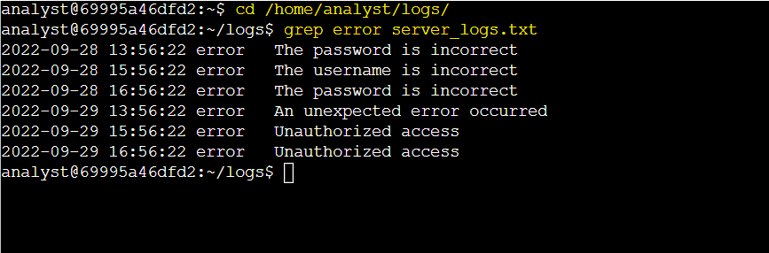
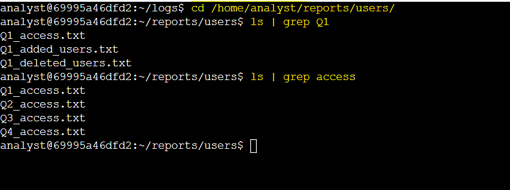
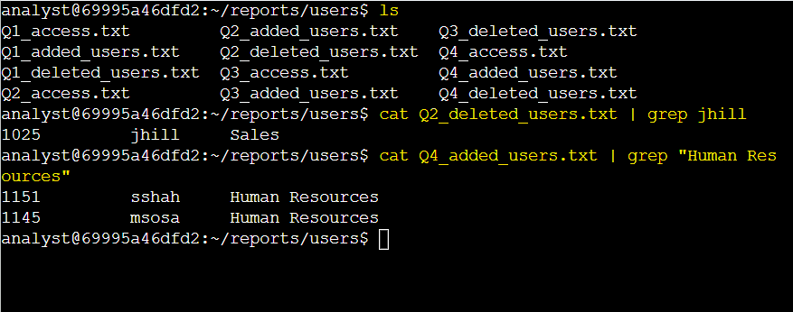

# Activity 5: Filter with grep

## Activity Overview

This lab provided hands-on practice with using the `grep` command and piping (`|`) to search for specific information in Linux files and directories.

The activity focused on filtering log entries, identifying files with specific strings in their names, and searching user data files for specific usernames and department information.

## Objectives

In this lab, I practiced how to:

- Navigate to specific directories using the `cd` command.
- Use `grep` to filter specific lines from a file.
- Use the pipe character (`|`) to pass command output to another command.
- Search for files containing specific strings in their names.
- Search file contents for specific usernames and department information.

## Commands Used

| Command | Purpose |
|---|---|
| `cd` | Changes the current working directory |
| `ls` | Lists files and directories in the current location |
| `grep` | Searches for lines containing a specified string |
| `cat` | Displays the complete contents of a file |
| `\|` | Pipes the output of one command to another command |

## Task 1: Search for Error Messages in a Log File

In this task, I navigated to the `/home/analyst/logs` directory and used the `grep` command to search the `server_logs.txt` file for error messages.

**1. Navigate to the `/home/analyst/logs` directory.**

I used the `cd` command to navigate to the `logs` directory using an absolute path.

```bash
cd /home/analyst/logs/
```

**2. Use `grep` to filter the `server_logs.txt` file and return all lines containing the text string `error`.**

I used the `grep` command to filter the contents of `server_logs.txt` and display only the lines containing the string `error`.

```bash
grep error server_logs.txt
```

### Lab Screenshot



**Key Finding:**

- The `grep` command returned `six` error entries from `server_logs.txt`.

## Task 2: Find Files Containing Specific Strings

In this task, I navigated to the `/home/analyst/reports/users` directory and used the pipe character (`|`) with the `ls` and `grep` commands to identify files containing specific strings in their names.

**1. Navigate to the `/home/analyst/reports/users` directory.**

I used the `cd` command to navigate to the `users` directory using an absolute path.

```bash
cd /home/analyst/reports/users/
```

**2. Using the pipe character (`|`), pipe the output of the `ls` command to the `grep` command to list only the files containing the string `Q1` in their names.**

I used the pipe character (`|`) to pass the output of the `ls` command to `grep`. The `grep` command filtered the output and displayed only filenames containing `Q1`.

```bash
ls | grep Q1
```

**3. List the files that contain the word `access` in their names.**

I used the pipe character (`|`) to pass the output of the `ls` command to `grep` and filter filenames containing `access`.

```bash
ls | grep access
```

### Lab Screenshot



**Key Findings:**

- There were `three` files containing `Q1` in their names.
- There were `four` files containing `access` in their names.

## Task 3: Search More File Contents

In this task, I searched user data files for a specific username and identified users who were added to the Human Resources department during quarter 4.

**1. Display the files in the `/home/analyst/reports/users` directory.**

I used the `ls` command to display the files available in the `users` directory.

```bash
ls
```

**2. Search the `Q2_deleted_users.txt` file for the username `jhill`.**

I used `cat` to display the contents of `Q2_deleted_users.txt` and piped the output to `grep` to search specifically for the username `jhill`.

```bash
cat Q2_deleted_users.txt | grep jhill
```

**3. Search the `Q4_added_users.txt` file to list the users who were added to the Human Resources department.**


```bash
cat Q4_added_users.txt | grep "Human Resources"
```

### Lab Screenshot



**Key Findings:**

- The username `jhill` was found in `Q2_deleted_users.txt`.
- `Two users` were added to the `Human Resources department` in quarter 4.

