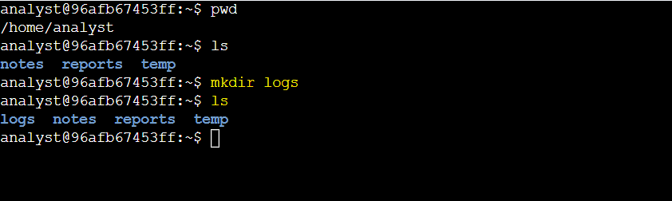
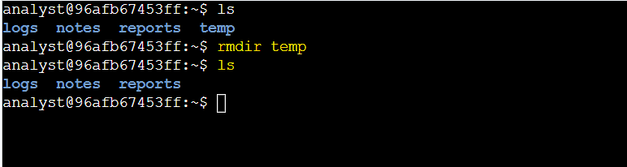
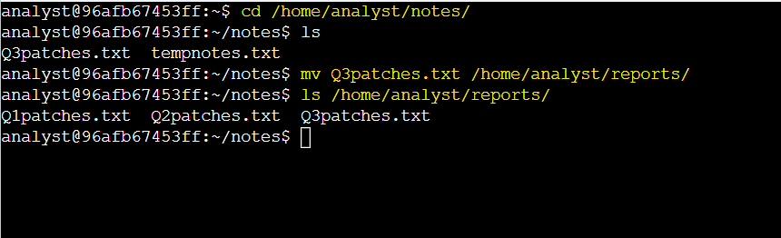
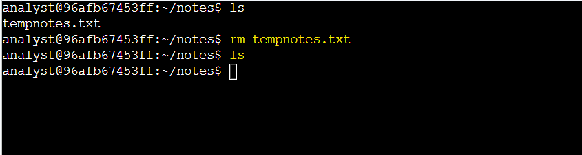
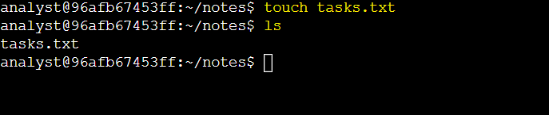
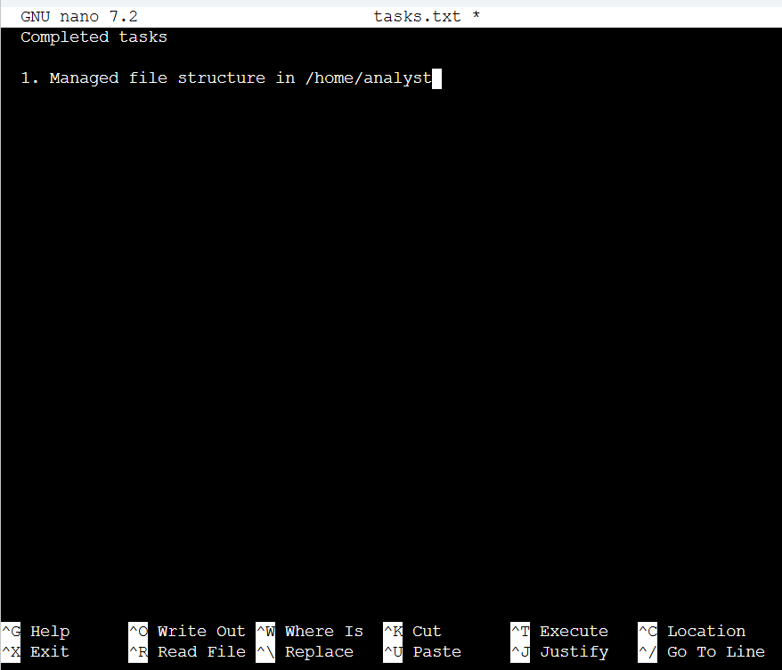
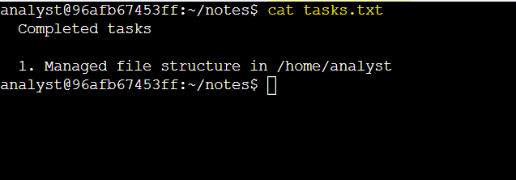

# Activity 6: Manage Files with Linux Commands

## Activity Overview

This lab provided hands-on practice with managing files and directories in a Linux environment.

The activity focused on creating and removing directories, moving and deleting files, creating a new file, and editing file contents using the `nano` text editor.

## Objectives

In this lab, I practiced how to:

* Navigate to specific directories using the `cd` command.
* Create directories using the `mkdir` command.
* Remove directories using the `rmdir` command.
* Move files using the `mv` command.
* Remove files using the `rm` command.
* Create empty files using the `touch` command.
* Edit files using the `nano` text editor.
* Display directory contents using the `ls` command.
* Display file contents using the `cat` command.
* Organize files into an appropriate directory structure.

## Commands Used

| Command | Purpose                                       |
| ------- | --------------------------------------------- |
| `cd`    | Changes the current working directory         |
| `ls`    | Lists files and directories                   |
| `mkdir` | Creates a new directory                       |
| `rmdir` | Removes an empty directory                    |
| `mv`    | Moves a file or directory to another location |
| `rm`    | Removes a file                                |
| `touch` | Creates an empty file                         |
| `nano`  | Opens a file in the Nano text editor          |
| `cat`   | Displays the contents of a file               |
| `clear` | Clears the terminal screen                    |

## Task 1: Create a New Directory

In this task, I created a new `logs` directory inside `/home/analyst` to provide a dedicated location for future log files.

**1. Create the `logs` directory in `/home/analyst`.**

I used the `mkdir` command to create the new directory.

```bash
mkdir logs
```

**2. List the contents of `/home/analyst` to verify that the directory was created.**

I used the `ls` command to verify that the new `logs` directory was present.

```bash
ls 
```

### Lab Screenshot



**Key Finding:**

* The `logs` directory was successfully created inside `/home/analyst`.

## Task 2: Remove a Directory

In this task, I removed the unused `temp` directory from `/home/analyst`.

**1. Remove the `/home/analyst/temp` directory.**

I used the `rmdir` command to remove the empty `temp` directory.

```bash
rmdir temp
```

**2. List the contents of `/home/analyst` to verify that the directory was removed.**

```bash
ls 
```

### Lab Screenshot



**Key Finding:**

* The `temp` directory was successfully removed from `/home/analyst`.

## Task 3: Move a File

In this task, I moved the `Q3patches.txt` file from the `notes` directory to the `reports` directory because it belonged with the other quarterly patch reports.

**1. Navigate to the `/home/analyst/notes` directory.**

I used the `cd` command to navigate to the `notes` directory.

```bash
cd /home/analyst/notes/
```

**2. Move `Q3patches.txt` from the `notes` directory to the `reports` directory.**

I used the `mv` command to move the file.

```bash
mv Q3patches.txt /home/analyst/reports/
```

**3. List the contents of the `reports` directory to verify that the file was moved successfully.**

```bash
ls /home/analyst/reports/
```

### Lab Screenshot



**Key Finding:**

* `Q3patches.txt` was successfully moved from the `notes` directory to the `reports` directory.
* The `reports` directory now contained the quarterly patch files `Q1patches.txt`, `Q2patches.txt`, and `Q3patches.txt`.

## Task 4: Remove a File

In this task, I removed the unused `tempnotes.txt` file from the `notes` directory.

**1. Remove `tempnotes.txt` from `/home/analyst/notes`.**

I used the `rm` command to delete the file.

```bash
rm tempnotes.txt
```

**2. List the contents of the `notes` directory to verify that the file was removed.**

```bash
ls
```

### Lab Screenshot



**Key Finding:**

* The unused `tempnotes.txt` file was successfully removed from the `notes` directory.

## Task 5: Create a New File

In this task, I created a new file called `tasks.txt` in the `notes` directory. The file was used to document the directory and file management tasks completed during the lab.

**1. Create an empty `tasks.txt` file in `/home/analyst/notes`.**

I used the `touch` command to create the new file.

```bash
touch tasks.txt
```

**2. List the contents of the `notes` directory to verify that the file was created.**

```bash
ls
```

### Lab Screenshot



**Key Finding:**

* The `tasks.txt` file was successfully created in the `notes` directory.

## Task 6: Edit a File

In this task, I used the `nano` text editor to add a record of the completed tasks to `tasks.txt`.

**1. Open `tasks.txt` using the Nano text editor.**

```bash
nano /home/analyst/notes/tasks.txt
```

**2. Add the following text to the file:**

```text
Completed tasks
1. Managed file structure in /home/analyst
```



I saved the changes and exited the Nano text editor.


**3. Clear the terminal and display the contents of `tasks.txt` to verify the changes.**

```bash
clear
cat tasks.txt
```

### Lab Screenshot



**Key Finding:**

* The `tasks.txt` file was successfully updated with a record of the completed file-management tasks.
