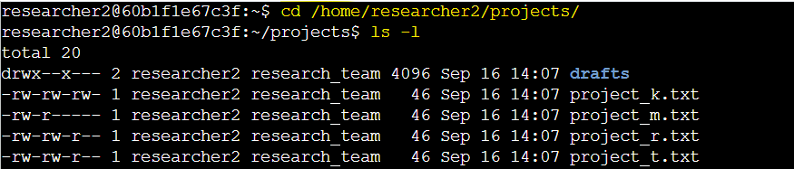
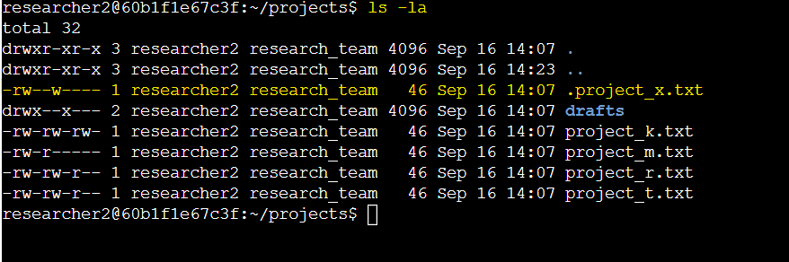
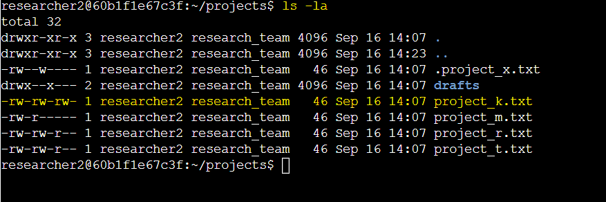
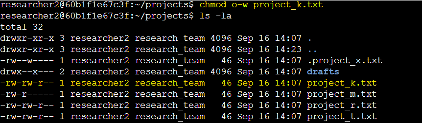
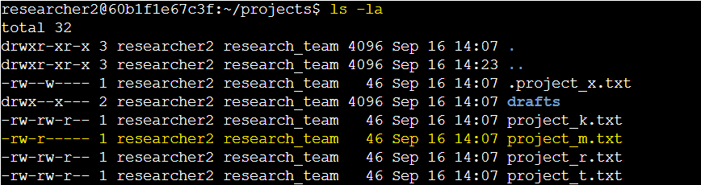
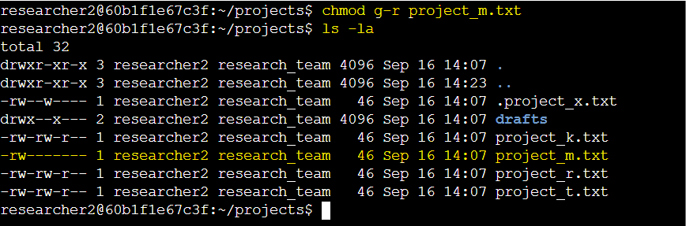
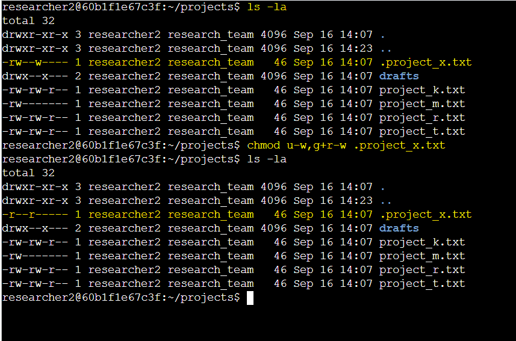
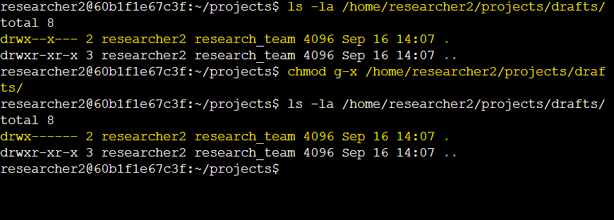

# Activity 7: Manage Authorization

## Activity Overview

In this lab activity, I used Linux Bash commands to examine and modify file and directory permissions to control authorization.

The activity focused on understanding Linux permissions for the user (owner), group, and other users, identifying unauthorized access, and applying appropriate permissions to files and directories.


## Objectives

- Examine Linux file and directory permissions.
- Identify file and directory ownership.
- Identify hidden files and review their permissions.
- Identify unauthorized write permissions.
- Modify file permissions using `chmod`.
- Restrict access to sensitive files.
- Modify permissions on a hidden file.
- Restrict access to a directory.
- Apply the principle of least privilege.

## Commands Used

| Command | Purpose |
|---|---|
| `cd` | Navigate between directories |
| `ls` | List files and directories |
| `ls -la` | List all files, including hidden files, with detailed permissions |
| `chmod` | Modify file and directory permissions |

---

## Task 1: Check File and Directory Details

**1: Navigate to the projects directory.**

The lab started in `/home/researcher2`. I navigated to the `projects` directory using an absolute path.

```bash
cd /home/researcher2/projects
```

**2: List the files and permissions.**

I used `ls -l` to display the contents of the directory, along with their permissions and ownership information.

```bash
ls -l
```

### Lab Screenshot



**3: Check whether any hidden files exist in the projects directory.**

I used `ls -la` to display hidden files that are normally not shown by a standard `ls` command.

```bash
ls -la
```

### Lab Screenshot



### Key Finding:

* The files in the `projects` directory were owned by the `researcher2` user and the `research_team` group. I also identified `.project_x.txt` as a hidden file that required a separate permissions review.

---

## Task 2: Change File Permissions

**1: Identify unauthorized write permissions.**

I used `ls -la` to identify unauthorized write permissions. After reviewing the permissions, `project_k.txt` had `-rw-rw-rw-`.

### Lab Screenshot




**2: Remove write permission for other users.**

I used the `chmod` command to remove write permission for the `other` owner type.

```bash
chmod o-w project_k.txt
```
### Lab Screenshot




**3: Check the permissions of project_m.txt.**

The `project_m.txt` file was a restricted file and should not be readable or writable by the group or other users.

I used `ls -la` to check the permissions of `project_m.txt`. After reviewing the permissions, `project_m.txt` had `-rw-r-----`.

### Lab Screenshot




**4: Remove group read and write permissions.**

The group had no write permission. So, I removed read permission only by using:

```bash
chmod g-r project_m.txt
```

### Lab Screenshot




### Key Findings:

* `project_k.txt` allowed other users to write to the file.
* I removed write permission for other users.
* `project_m.txt` had read permission assigned to the group.
* I removed the group's read permission from `project_m.txt`.

---

## Task 3: Change File Permissions on a Hidden File

**1: Check the permissions of the hidden file.**

I used the following command to check the permissions of the hidden file.

```bash
ls -la
```
The hidden file in the `projects` directory was `.project_x.txt` with `-rw--w----` permissions.

The file was an archived file and should not be writable by anyone. The user and group should still be able to read the file.

**2: Remove write permissions.**

I removed write permission for both the user and the group and added read permission for the group using:

```bash
chmod u-w,g+r-w .project_x.txt
```

This preserved read access while preventing the user and group from modifying the archived file.

### Lab Screenshot



### Key Finding:

* The hidden `.project_x.txt` file had incorrect write permissions. I removed write access for both the user and group while maintaining their read access.

---

## Task 4: Change Directory Permissions

**1: Check the permissions of the drafts directory.**

I checked the permissions of the drafts directory using an absolute path.

```bash
ls -la /home/researcher2/projects/drafts
```
The directory initially had `drwx--x---` permissions.

**2: Remove execute permission for the group.**

I removed execute permission for the group using an absolute path. 

```bash
chmod g-x /home/researcher2/projects/drafts
```
This prevented the group from accessing or traversing the `drafts` directory.

### Lab Screenshot



### Key Finding:
* The group had execute permission on the `drafts` directory. I removed this permission so that only the `researcher2` user retained execute access.

