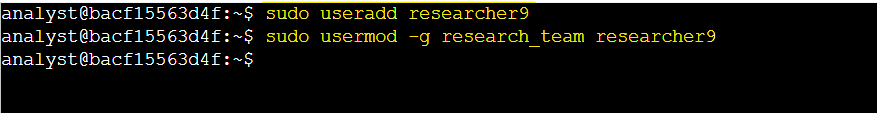
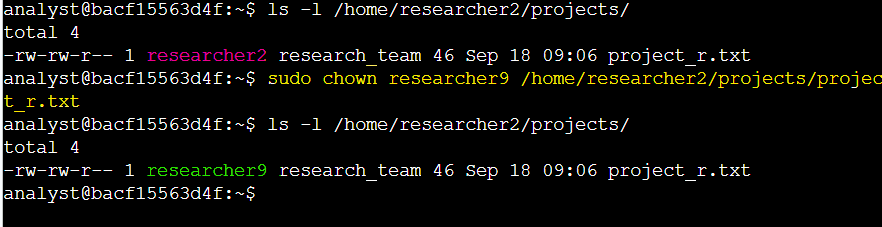
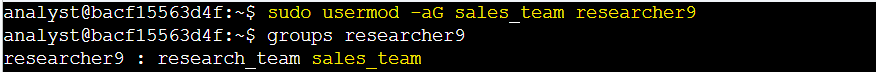
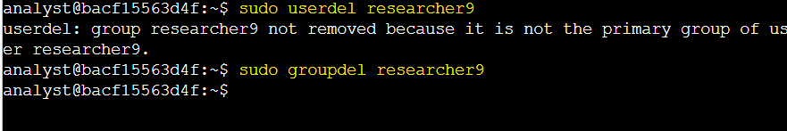

# Activity 7: Add and Manage Users with Linux Commands

## Activity Overview

This lab provided hands-on practice with managing user accounts, group memberships, file ownership, and user access in a Linux environment.

The activity focused on creating a new user, assigning a primary group, changing file ownership, adding the user to a supplementary group, and deleting the user when they left the organization.


## Objectives

In this lab, I practiced how to:

* Create a new user account using the `useradd` command.
* Assign a user to a primary group using the `usermod` command with the `-g` option.
* Change file ownership using the `chown` command.
* Add a user to a supplementary group using the `usermod` command with the `-a` and `-G` options.
* Delete a user account using the `userdel` command.
* Remove an unused group using the `groupdel` command.

## Commands Used

| Command    | Purpose                                                                             |
| ---------- | ----------------------------------------------------------------------------------- |
| `useradd`  | Creates a new user account                                                          |
| `usermod`  | Modifies an existing user account                                                   |
| `-g`       | Assigns or changes a user's primary group                                           |
| `-aG`      | Adds a user to a supplementary group without removing existing supplementary groups |
| `chown`    | Changes the owner of a file or directory                                            |
| `userdel`  | Deletes a user account                                                              |
| `groupdel` | Deletes a group                                                                     |
| `sudo`     | Runs a command with superuser privileges                                            |

## Task 1: Add a New User

In this task, I created a new user named `researcher9` and assigned the user to the `research_team` group as their primary group.

**1. Write a command to add a user called `researcher9` to the system.**

I used the `useradd` command with `sudo` because creating a user account requires administrative privileges.

```bash
sudo useradd researcher9
```

**2. Use the usermod command and -g option to add `researcher9` to the `research_team` group as their primary group.**

```bash
sudo usermod -g research_team researcher9
```

### Lab Screenshot



**Key Findings:**

* The `researcher9` user was successfully created.
* The `research_team` group was assigned as the user's primary group.
* The `-g` option is used to change a user's primary group.

## Task 2: Assign File Ownership

In this task, I assigned ownership of the `project_r.txt` file to the new `researcher9` user.

The file was located in the `/home/researcher2/projects` directory and was originally owned by the `researcher2` user.

**1. Use the chown command to make `researcher9` the owner of `/home/researcher2/projects/project_r.txt`.**


```bash
sudo chown researcher9 /home/researcher2/projects/project_r.txt
```

### Lab Screenshot



**Key Findings:**

* Ownership of `project_r.txt` was successfully changed to `researcher9`.
* The `chown` command can be used to manage file ownership and support appropriate access control.

## Task 3: Add the User to a Secondary Group

**1. Use the usermod command with the `-a` and `-G` options to add `researcher9` to the `sales_team` group as a secondary group.**


```bash
sudo usermod -aG sales_team researcher9
```

### Lab Screenshot



**Key Findings:**

* `researcher9` was added to the `sales_team` supplementary group.
* The user's primary group remained `research_team`.
* Using `-aG` allows a supplementary group to be added without removing existing supplementary group memberships.

## Task 4: Delete a User


**1. Run a command to delete researcher9 from the system.**

I used the `userdel` command with `sudo`.

```bash
sudo userdel researcher9
```

****2. Remove the unused `researcher9` group.****


```bash
sudo groupdel researcher9
```

### Lab Screenshot



**Key Findings:**

* The `researcher9` user account was successfully deleted.
* The `researcher9` group was not automatically removed because it was no longer the user's primary group. The unused `researcher9` group was then removed using `groupdel`.
* Removing unused accounts and groups helps keep user access and system configuration organized.
