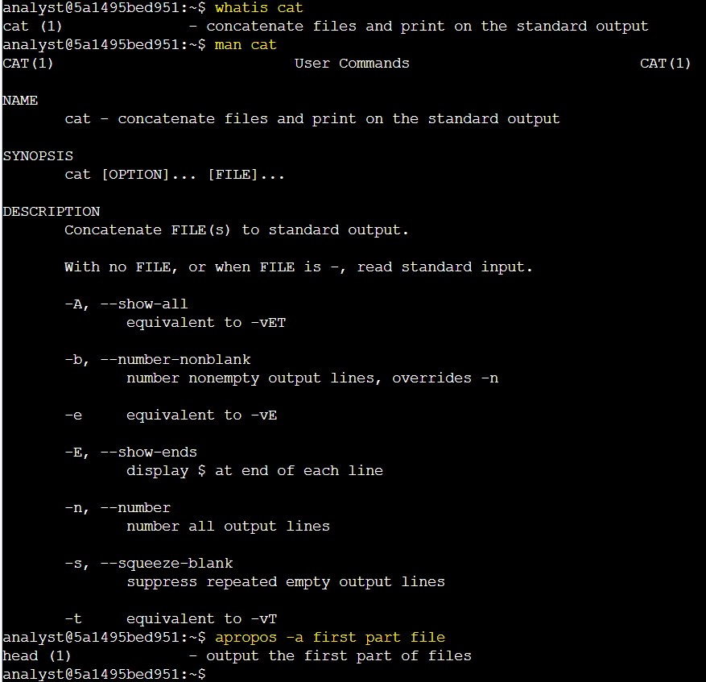
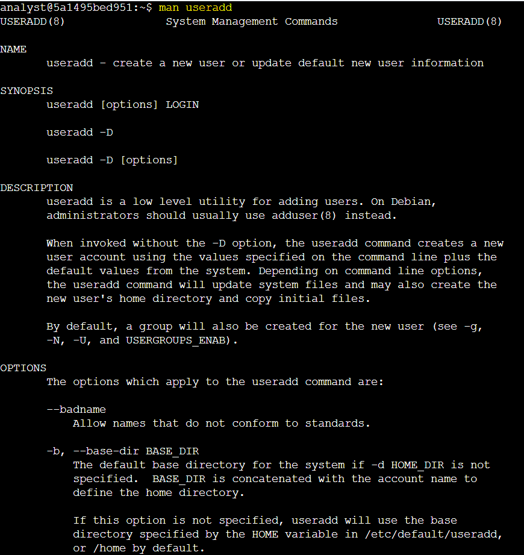
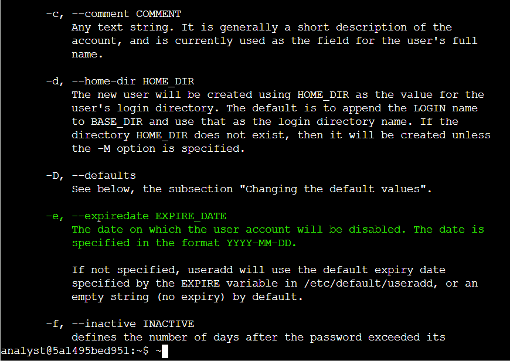

# Activity 7: Get Help in the Command Line

## Activity Overview

This lab provided hands-on practice with using built-in Linux help resources to learn about commands, their options, and their functionality.

The activity focused on using the `whatis`, `man`, and `apropos` commands to find information about Linux commands and identify the appropriate command for a specific task.

## Objectives

In this lab, I practiced how to:

* Use the `whatis` command to get a brief description of a Linux command.
* Use the `man` command to access detailed documentation and available options.
* Identify command options by reviewing manual pages.
* Use the `apropos` command to search for commands based on keywords.
* Understand the difference between the `rm` and `rmdir` commands.
* Identify the appropriate command for creating a new Linux group.
* Use Linux command-line documentation to find commands and options when they are not familiar.

## Commands Used

| Command    | Purpose                                                           |
| ---------- | ----------------------------------------------------------------- |
| `whatis`   | Displays a brief description of a command                         |
| `man`      | Displays the detailed manual page for a command                   |
| `apropos`  | Searches manual-page descriptions using keywords                  |
| `cat`      | Concatenates files and displays their contents                    |
| `useradd`  | Creates and manages user accounts                                 |
| `rm`       | Removes files and can remove directories with appropriate options |
| `rmdir`    | Removes empty directories                                         |
| `groupadd` | Creates a new Linux group                                         |
| `q`        | Exits a manual page                                               |

## Task 1: Learn More About Commands

In this task, I explored several Linux commands that can be used to learn more about other commands and their functionality.

**1. Run the `whatis` command to get a short description of cat.**

```bash
whatis cat
```

**2. Use the `man` command to get more details about `cat`.**

```bash
man cat
```

**3. Use `apropos` to find a command that returns the first part of a file.**

I used `apropos` with keywords related to the task.

```bash
apropos -a first part file
```

### Lab Screenshot:



**Key Findings:**

* The `whatis` command provides a quick description of a Linux command.
* The `man` command provides detailed information about a command and its options.
* The `-n` or `--number` option can be used with `cat` to number output lines.
* The `apropos` command can be used to find commands based on keywords.
* The `head` command displays the beginning portion of a file.

## Task 2: Explore the `useradd` Command

In this task, I explored the `useradd` command to determine which option can be used to set an expiration date for a temporary user account.

**1. Use the most appropriate Linux command to get help on the `useradd` command and learn more about all of its options.**

I used the `man` command to access detailed information about `useradd` and its available options.

```bash
man useradd
```
### Lab Screenshots:





**Key Findings:**

* The `man` command can be used to investigate unfamiliar Linux commands and their options.
* The `-e` option of `useradd` is used to set an account expiration date.

## Task 3: Explore the `rm` and `rmdir` Commands

In this task, I determined the difference between the `rm` and `rmdir` commands.

**1. Use the most appropriate Linux command to quickly remind yourself what each command does.**

I used the `whatis` command to quickly review the purpose of `rm`.

```bash
whatis rm
```
I then used the `whatis` command to review the purpose of `rmdir`.

```bash
whatis rmdir
```
After comparing the descriptions, I identified which command removes only empty directories.
### Lab Screenshot:


**Key Findings:**

* The `rmdir` command removes empty directories.
* The `rm` command is used to remove files and can also remove directories when used with the appropriate options.

## Task 4: Determine Which Command to Use

In this task, I needed to identify the Linux command used to create a new group.


**1. Use the most appropriate Linux command with these keywords to identify what command to use.**

I used the keywords `create a new group` with `apropos`.

```bash
apropos -a create new group
```

**Key Finding:**

* The `apropos` command can help identify an unfamiliar command by searching manual-page descriptions using keywords.
* `groupadd` is used to create a new Linux group.

### Lab Screenshot:

